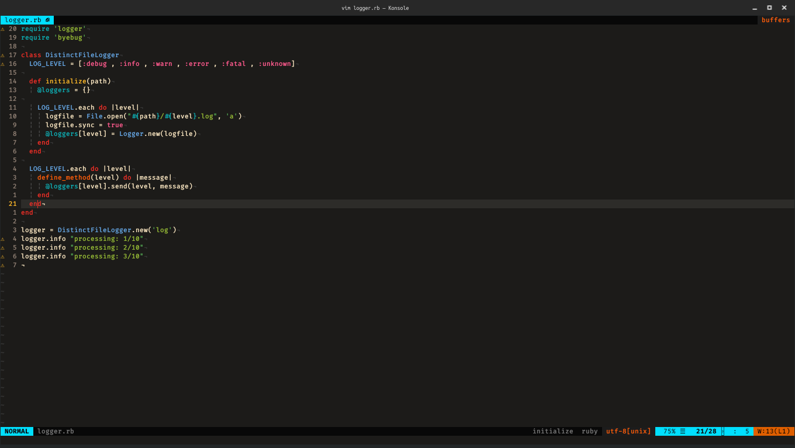

# Dotfiles

Personal configuration files for my development environment.



The repository is organized by application so each configuration can be installed, understood, and maintained independently.

## Configurations

| Configuration | Purpose | Documentation |
|---|---|---|
| `nvim/` | Neovim editor and development environment | [README](nvim/README.md) |
| `vim/` | Legacy Vim configuration | [README](vim/README.md) |
| `vscode/` | Visual Studio Code settings | [README](vscode/README.md) |
| `kitty/` | Kitty terminal configuration | [README](kitty/README.md) |
| `tmux/` | tmux terminal multiplexer configuration | [README](tmux/README.md) |
| `zsh/` | Zsh shell configuration | [README](zsh/README.md) |
| `ranger/` | Ranger terminal file manager configuration | [README](ranger/README.md) |
| `polybar/` | Polybar desktop status bar configuration | [README](polybar/README.md) |
| `windows-terminal/` | Windows Terminal settings | [README](windows-terminal/README.md) |

## Utilities

- `nerd_fonts.sh` — helper for installing Nerd Fonts.
- `screenshot.png` — example desktop/editor screenshot.
- `install-nvim.sh` — Ubuntu installer for the modern Neovim configuration.

## Neovim

Neovim is the primary actively maintained editor configuration in this repository. It is a modular setup aimed at daily software development with Ruby/Rails, TypeScript/JavaScript, Python, Go, Docker, YAML, JSON, Bash, and Markdown.

For installation, architecture, tooling, keymaps, and troubleshooting, see [`nvim/README.md`](nvim/README.md).

### Quick install

From a cloned repository on Ubuntu:

```bash
./install-nvim.sh
```

The installer is designed to be idempotent and backs up an existing `~/.config/nvim` before linking the repository configuration.

## Repository principles

- Keep application configurations independent.
- Document installation and usage next to the configuration they describe.
- Prefer reproducible, scriptable setup over manual steps.
- Keep legacy configurations available until a replacement has been validated.
