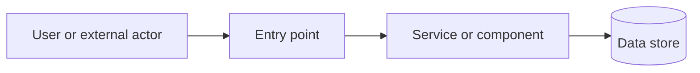
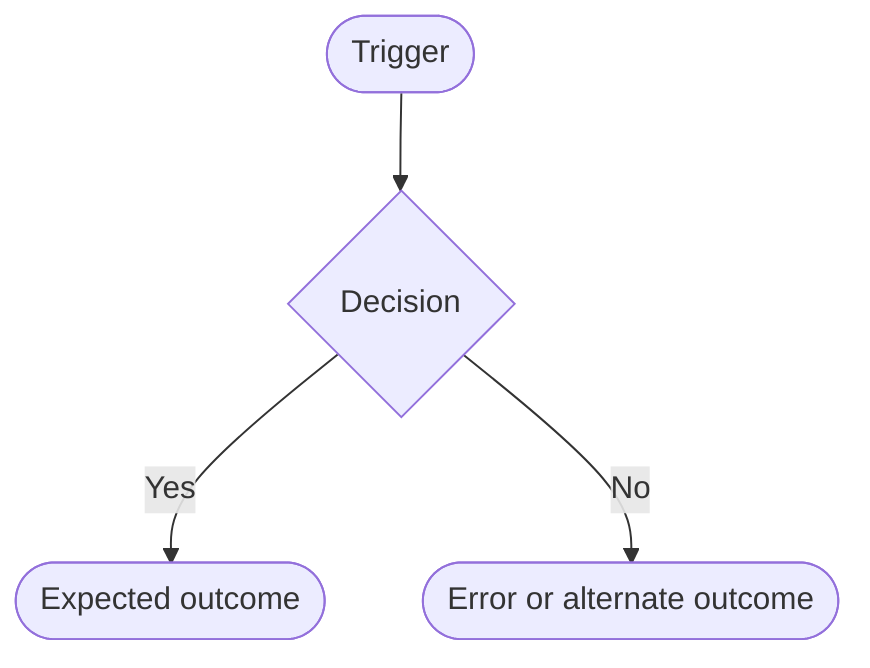
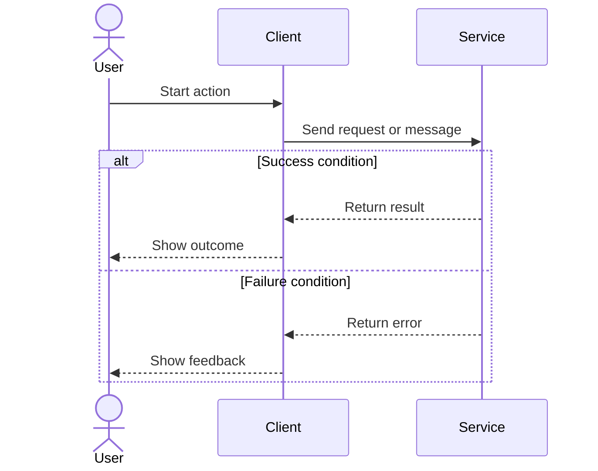
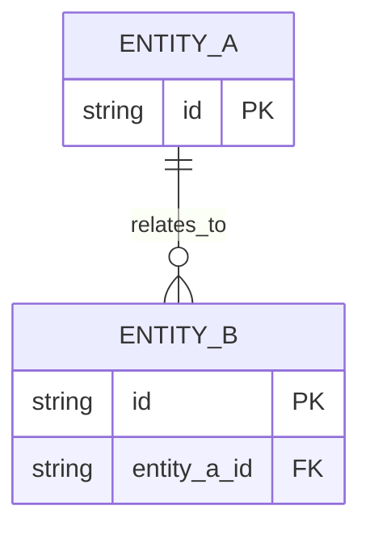

# Technical Document: <project or feature>

> Template instructions: Replace angle-bracket prompts with inspected facts or clearly labeled proposals. Use `TBD — <decision owner or next step>` for blockers and `Not applicable — <reason>` only when the project truly has no relevant entity, API, event, or lifecycle for a particular section. Do not include these instructions in the finished document. Keep heading order and existing IDs stable on edits; keep task granularity proportional to the work. The PRD defines *what and why*; this document defines *how, verification, and delivery*.

| Field | Value |
| --- | --- |
| Status | Draft / In review / Approved (only if approval is confirmed) |
| Technical owner | <role or named person, if known> |
| Project / feature | <name> |
| Last updated | <date of this edit> |
| PRD | <link to PRD or TBD> |

## 1. Summary and scope

- **Problem and proposed solution:** <brief summary; link to PRD rather than duplicating all product details>
- **In scope / out of scope:** <technical boundaries and exclusions>
- **Constraints and assumptions:** <verified constraints separately from assumptions>
- **Success and acceptance:** <relevant PRD requirement IDs or explicitly labeled provisional requirements>

## 2. Current state

<Relevant components, dependencies, code paths, data flow, infrastructure, tests, and limitations. Cite inspected repository paths/docs. Identify unknowns instead of describing an unverified system as fact.>

## 3. Proposed design and diagrams

Use fenced `mermaid` blocks for diagrams so they remain editable and reviewable in Markdown. Every diagram subsection below is required. Model the actual proposed system rather than leaving generic example nodes in the finished document. Label assumptions and indicate external actors, trust boundaries, and failure paths when relevant. If a particular diagram genuinely cannot apply, explicitly say why; a high-level diagram and the main flowchart and sequence diagram should normally always be present.

### 3.1 High-level architecture diagram

<Show users/external systems, application components, storage, and the major connections and ownership boundaries. Explain what each component owns.>

### 3.2 Flowchart diagram

<Show the primary business or system workflow from trigger to outcome, including decisions and the most important failure path.>

### 3.3 Sequence diagram

<Show the time-ordered interactions across actors/components for the primary scenario, including response and failure behavior. Add another sequence if an important asynchronous or error flow needs it.>

### 3.4 Entity relationship diagram (ERD)

<Show affected persisted entities, keys, and cardinality. Include existing related entities when they explain the change. If no persistent entities exist or change and none are relevant, write `Not applicable — <specific reason>` instead of inventing a schema.>

### 3.5 Additional diagrams (when relevant)

<Add deployment topology, state machine, data lifecycle, trust boundary, or migration diagram when it makes a significant decision clearer. Cross-reference the diagram from the relevant design or delivery section.>

## 4. Data, API, and event contracts

Keep each contract subsection, even when the system has no such interface; state `Not applicable — <specific reason>` in that case. Use concrete names and examples based on verified or proposed behavior. Link existing OpenAPI, schema, or event definitions instead of duplicating their full contents, but summarize the change and its compatibility impact here.

### 4.1 Data contracts

<For each data object or persisted entity: name, producer/owner, consumer, field name, type, required/nullable/default, validation and invariants, key and relationships, sensitive-data classification, retention, schema version, and compatibility/migration behavior. Show a representative JSON/schema example when data crosses a boundary.>

| Object / field | Type | Required / nullable / default | Validation / meaning | Producer → consumer | Version / compatibility |
| --- | --- | --- | --- | --- | --- |
| <object.field> | <type> | <rule> | <invariant> | <owner → user> | <version / migration> |

### 4.2 API contracts

<For each new or changed API: protocol, method and path or operation name, purpose, caller, authentication and authorization, request (path/query/headers/body), response with status and schema, validation errors, other error codes, pagination/idempotency/rate limits where relevant, versioning, and backward compatibility. Include a representative request/response or link to the source contract.>

| API / operation | Caller and auth | Request contract | Success response | Errors | Version / compatibility |
| --- | --- | --- | --- | --- | --- |
| <method path or operation> | <role / permission> | <schema / example> | <status + schema> | <status + condition> | <impact> |

### 4.3 Event contracts

<For each emitted or consumed event: name/topic, producer, consumers, trigger, envelope/payload schema and example, schema version, ordering and delivery guarantees, idempotency/deduplication, retry/dead-letter handling, privacy, and compatibility. For systems without events, explicitly state why not applicable.>

| Event / topic | Producer → consumer | Trigger | Payload / schema version | Delivery, ordering, retries | Compatibility |
| --- | --- | --- | --- | --- | --- |
| <name> | <producer → consumers> | <when> | <fields + version> | <guarantees / failure policy> | <impact> |

### 4.4 Other interfaces and quality attributes

<Describe third-party integrations, files, jobs, UI states, and configuration contracts where relevant. Address security/privacy, accessibility, performance, reliability, observability, maintainability, and cost in proportion to the change. State measurable limits only when known.>

## 5. Decisions and alternatives

| Decision ID | Options considered | Chosen approach and reason | Tradeoff / consequence | Status |
| --- | --- | --- | --- | --- |
| DEC-001 | <options> | <choice or TBD> | <consequence> | Proposed / Decided / Open |

## 6. Migration, rollout, and rollback

- **Compatibility and migration:** <schema/data/API transition, backfill, and existing-client impact>
- **Release sequence and prerequisites:** <order of steps, environments, config, approvals, feature flags if needed>
- **Validation and monitoring:** <health checks, signals, and go/no-go gates>
- **Rollback and recovery:** <reversal steps and known irreversibility>

## 7. Verification plan

| Requirement ID | Verification level and scenario | Owner role | Evidence / release gate |
| --- | --- | --- | --- |
| PRD-001 | <unit / integration / E2E / manual; expected outcome> | <role> | <check or artifact> |

<Include failure, authorization, migration, and regression scenarios when relevant; distinguish planned tests from executed evidence.>

## 8. Risks, dependencies, and open questions

| Type | Item | Impact | Mitigation / decision needed | Owner role | Status |
| --- | --- | --- | --- | --- | --- |
| Risk / Dependency / Question | <item> | <impact> | <action> | <role> | Open / Resolved |

## 9. Task breakdown

Use stable IDs `TASK-001`, `TASK-002`, etc. Group rows by milestone and dependency order. **Every task title MUST start with an action verb** (e.g. Define, Design, Implement, Migrate, Test, Validate, Deploy, Document). Do not start task titles with nouns such as `API`, `Database`, or `Testing`. Each task should yield a reviewable deliverable, not merely an activity. Use relative sizing (S/M/L or `Unknown — <reason>`) rather than invented dates; dependencies refer to task IDs. Include product decisions, diagrams/contracts, backend/frontend, QA, migration, DevOps, integration, and handoffs only where applicable.

| ID | Milestone | Task (verb-first) | Owner role | Deliverable | Requirement IDs | Dependencies | Completion / verification criteria | Size or uncertainty |
| --- | --- | --- | --- | --- | --- | --- | --- | --- |
| TASK-001 | <milestone> | Define the API contract | <Product Manager / Architect / Team Leader / Backend / Frontend / QA / DevOps> | <reviewed contract artifact> | <PRD IDs> | <None or TASK IDs> | <testable done condition> | <S/M/L or Unknown + reason> |

**Parallel work and handoffs:** <tasks that may proceed together and the contract/decision required to connect them.>

**Critical path and blockers:** <dependency chain and unresolved decisions, if nontrivial.>

## 10. Change log

| Date | Change and reason | Affected decision / PRD / task IDs | Source |
| --- | --- | --- | --- |
| <date> | <change> | <IDs> | <source> |

## Technical document review checklist

- [ ] The design addresses each in-scope PRD requirement ID, or gaps are explicitly marked TBD.
- [ ] High-level architecture, flowchart, sequence, and ERD sections contain project-specific Mermaid diagrams; any truly inapplicable ERD has a specific explanation.
- [ ] Data, API, and event contract sections state concrete schemas, producers/consumers, errors or delivery behavior, and compatibility, or explicitly justify why the interface is absent.
- [ ] Current-state claims have evidence; proposed designs and assumptions are labeled.
- [ ] Interfaces, failure behavior, and relevant security/operational considerations are explicit.
- [ ] Verification covers requirements and release gates; planned versus executed checks are distinct.
- [ ] Every task title starts with an action verb and has a role, deliverable, dependencies, completion criteria, and uncertainty/size.
- [ ] Dependencies are consistent; migration/rollout/rollback and open decisions have owners where relevant.
